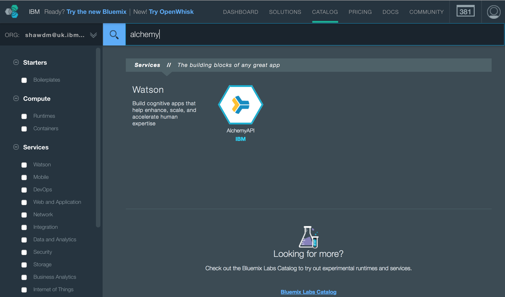
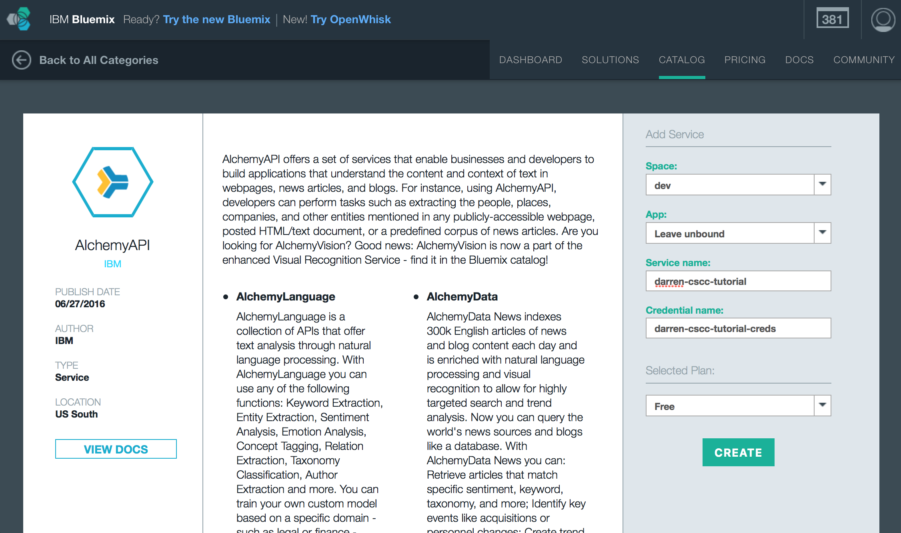
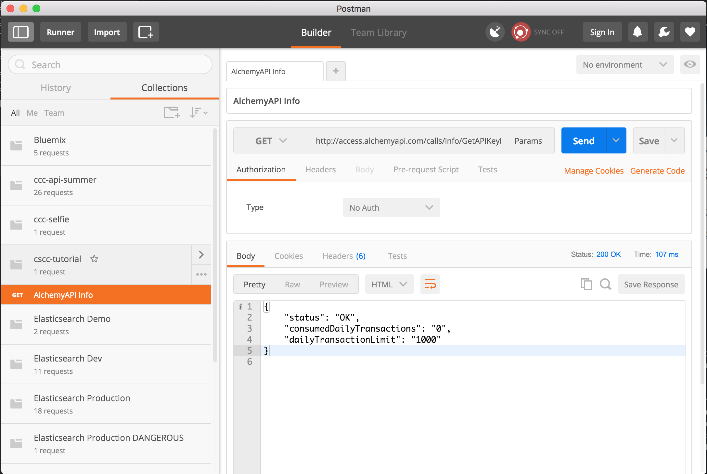

## Prereqs
1. A Bluemix account, go to https://console.ng.bluemix.net to create a free one if you don't have one.

2. A REST test client. curl will be fine, I use https://www.getpostman.com but there are also browser based ones like https://www.hurl.it.

## Alchemy Language APIs
#### Logon To Bluemix
1. Go to https://console.ng.bluemix.net and logon

#### Create A New Alchemy Service Instance
2. Click the Catalog tab and enter 'alchemy' in the search box.

 
3. Click on the AlchemyAPI tile.

4. Fill in the 'Add Service' details in the box on the right.
  * Space: dev
  * App: Leave unbound
  * Service name: {anything}
  * Credential name: {anything}
  * Selected Plan: Free

 
5. Click 'Create'.

6. Select 'Service Credentials' in the left panel and note down your URL and API key.

#### Test the API
1. The free plan limits you to 1000 requests/day. There is an API call to see how many requests you've made (which doesn't count towards your limit), and tests that your API key has been successfully created.

2. Open up your REST test client (e.g. Postman) and do a GET request to `http://access.alchemyapi.com/calls/info/GetAPIKeyInfo?apikey= {your API key here}&outputMode=json` if your API key has been successfuly created you'll receive a JSON response with the number of requests made today and your daily limit.


#### Calling the Entity Extraction API
The entity extraction API finds entities (people, places, organisations etc.) within text.  Full documentation of the API can be found here: https://www.alchemyapi.com/api/entity-extraction

1. Open up your REST test client and do a GET request to: `http://gateway-a.watsonplatform.net/calls/text/TextGetRankedNamedEntities?apikey={your API key here}&outputMode=json&text={your text here}`.

2. The API should return a list of entities found within the text formatted in JSON format.  Sending the text 'Andy Murray and Liam Broady make their way off court to a standing ovation... #Wimbledon' returns the JSON:
```json
{
  "status": "OK",
  "usage": "By accessing AlchemyAPI or using information generated by AlchemyAPI, you are agreeing to be bound by the AlchemyAPI Terms of Use: http://www.alchemyapi.com/company/terms.html",
  "url": "",
  "language": "english",
  "entities": [
    {
      "type": "Person",
      "relevance": "0.33",
      "count": "1",
      "text": "Andy Murray",
      "disambiguated": {
        "subType": [
          "Athlete",
          "TennisPlayer",
          "OlympicAthlete"
        ],
        "name": "Andy Murray",
        "website": "http://www.andymurray.com/",
        "dbpedia": "http://dbpedia.org/resource/Andy_Murray",
        "freebase": "http://rdf.freebase.com/ns/m.03wc52"
      }
    },
    {
      "type": "Person",
      "relevance": "0.33",
      "count": "1",
      "text": "Liam Broady",
      "disambiguated": {
        "name": "Liam Broady",
        "dbpedia": "http://dbpedia.org/resource/Liam_Broady",
        "freebase": "http://rdf.freebase.com/ns/m.0gwyrjm"
      }
    }
  ]
}
```


Full AlchemyAPI documentation can be found here: https://www.alchemyapi.com/api
