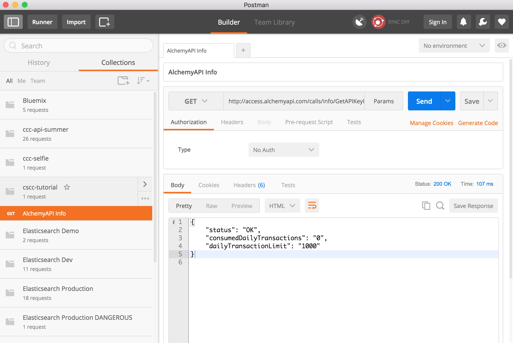
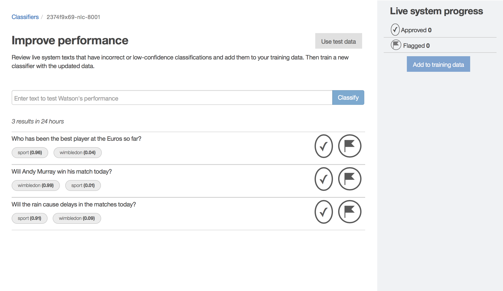

# Cognitive Social Command Centre Tutorial
 

The Cognitive Social Command Centre (CSCC) was created for Wimbledon 2016. The application helps Wimbledon's editorial team understand and react to tournament related social media content. The CSCC was built on IBM Bluemix, making use of the Watson services to analyse text content on Twitter, Facebook, YouTube and Instagram.

This tutorial explains how developers can use some of these Watson services in their own development work.

## Contents
`/sample-code` - Sample Javascript code showing how the Alchemy and Watson APIs can be called programatically.

`/sample-nlc-training` - CSV file containing example training data for use with Watson Natural Language Classifier.

`/sample-tweets` - text content from a selection of Tweets captured during Wimbledon 2016, for use as test data.


## Prereqs
1. A Bluemix account, go to https://console.ng.bluemix.net to create a free one.

2. A REST test client. Curl will be fine, I use https://www.getpostman.com but there are also browser based ones like https://www.hurl.it.

## Alchemy Language APIs
#### Logon To Bluemix
1. Go to https://console.ng.bluemix.net and logon

#### Create A New Alchemy Service Instance
2. Click the Catalog tab and enter 'alchemy' in the search box.

 

3. Click on the AlchemyAPI tile.

4. Fill in the 'Add Service' details in the box on the right.
  * Space: dev
  * App: Leave unbound
  * Service name: {anything}
  * Credential name: {anything}
  * Selected Plan: Free

 
5. Click 'Create'.

6. Select 'Service Credentials' in the left panel and note down your URL and API key.

#### Test the API
1. The free plan limits you to 1000 requests/day. There is an API call to see how many requests you've made (which doesn't count towards your limit), and tests that your API key has been successfully created.

2. Open up your REST test client (e.g. Postman) and do a GET request to `http://access.alchemyapi.com/calls/info/GetAPIKeyInfo?apikey={your API key here}&outputMode=json`. If your API key has been successfully created you'll receive a JSON response with the number of requests made today and your daily limit.


#### Calling the Entity Extraction API
The entity extraction API finds entities (people, places, organisations etc.) within text. Full documentation of the API can be found here: http://www.ibm.com/smarterplanet/us/en/ibmwatson/developercloud/alchemy-language/api/v1/#entities

1. Open up your REST test client and do a GET request to: `http://gateway-a.watsonplatform.net/calls/text/TextGetRankedNamedEntities?apikey={your API key here}&outputMode=json&text={your text here}`.

2. The API will return a list of entities found. For example, sending the text 'Andy Murray and Liam Broady make their way off court to a standing ovation... #Wimbledon' returns the JSON:

  ```json
  {
    "status": "OK",
    "usage": "By accessing AlchemyAPI or using information generated by AlchemyAPI, you are agreeing to be bound by the AlchemyAPI Terms of Use: http://www.alchemyapi.com/company/terms.html",
    "url": "",
    "language": "english",
    "entities": [
      {
        "type": "Person",
        "relevance": "0.33",
        "count": "1",
        "text": "Andy Murray",
        "disambiguated": {
          "subType": [
            "Athlete",
            "TennisPlayer",
            "OlympicAthlete"
          ],
          "name": "Andy Murray",
          "website": "http://www.andymurray.com/",
          "dbpedia": "http://dbpedia.org/resource/Andy_Murray",
          "freebase": "http://rdf.freebase.com/ns/m.03wc52"
        }
      },
      {
        "type": "Person",
        "relevance": "0.33",
        "count": "1",
        "text": "Liam Broady",
        "disambiguated": {
          "name": "Liam Broady",
          "dbpedia": "http://dbpedia.org/resource/Liam_Broady",
          "freebase": "http://rdf.freebase.com/ns/m.0gwyrjm"
        }
      }
    ]
  }
  ```


#### Calling The Sentiment API
The sentiment API scores text for sentiment. Full documentation of the API can be found here: http://www.ibm.com/smarterplanet/us/en/ibmwatson/developercloud/alchemy-language/api/v1/#sentiment

1. Open your REST test client and do a GET request to: `http://gateway-a.watsonplatform.net/calls/text/TextGetTextSentiment?apikey={your API key here}&outputMode=json&text={your text here}`.

2. The API will return a sentiment assessment for the whole document in terms of a type (positive, negative, neutral) and a more specific score (-1 to +1). For example, sending the text 'Andy Murray and Liam Broady make their way off court to a standing ovation... #Wimbledon' returns the JSON:

  ```json
  {
    "status": "OK",
    "usage": "By accessing AlchemyAPI or using information generated by AlchemyAPI, you are agreeing to be bound by the AlchemyAPI Terms of Use: http://www.alchemyapi.com/company/terms.html",
    "totalTransactions": "1",
    "language": "english",
    "docSentiment": {
      "score": "0.446109",
      "type": "positive"
    }
  }
  ```

## Watson Natural Language Classifier API
#### Logon To Bluemix
1. Go to https://console.ng.bluemix.net and logon

#### Create A New Watson Natural Language Classifier Service Instance
1. Click the Catalog tab and enter 'natural language classifier' in to the search box.

 

2. Click on the 'Natural Language Classifier' tile.

4. Fill in the 'Add Service' details in the box on the right.
  * Space: dev
  * App: Leave unbound
  * Service name: {anything}
  * Credential name: {anything}
  * Selected Plan: Standard

  

5. Click 'create'.

6. Select 'Service Credentials' in the left panel and note down your username and password.

#### Train Watson Natural Language Classifier
The service instance you have just created is blank, it needs to be trained before it can be used.

1. Select 'Manage' in the left panel and click the 'Access the beta toolkit' button in the main panel.  This will open a page with a button that says, 'Sign in with Bluemix', click the button to authenticate.

  

2. You will be asked to confirm that you want to give the toolkit access to your NLC service instance, hit 'confirm' and you'll be taken to the toolkit homepage. Click on the 'Add training data' link to start the process of training the classifier.

  

3. The training data page will load, click the 'Upload training data' icon in the top right corner and select a CSV file with training data in. There is some sample training data in `sample-nlc-training/sample-classes.csv`. Training data is in the form of example text and a comma separated list of classes that the example should be classified to. In the sample, tweets are classified into either 'wimbledon' or 'sport'.   

  

  Once the training data has been uploaded you'll be able to review the example texts and classes you are adding.

  

  If you are happy with the training data, click 'Create classifier' to begin training the classifier.

4. You'll be asked to enter a name for the classifier and the language of the text you are training it for.  

    

    Click 'create' to start the training process.  Training a classifier can take a long time, from minutes to hours, depending on the load on the server and the size of your training data. The process will run in the background, so you don't need to stay on the page. Hit the browser refresh button and you'll see an update of the training status.

    

    When the training has finished the classifier status will change to 'Available' and you'll see an ID for the classifier.  Make a note of the classifier ID.

    

    The newly created classifier can be tested from within the toolkit, click the arrow icon in the bottom right corner, the 'Improve performance' page will open.

    

    This page allows you to enter text and see the classes (and the confidence) that the classifier assigns to the text.


#### Calling the Natural Language Classifier API
1. Open up your REST test client and do a GET request to: `https://gateway.watsonplatform.net/natural-language-classifier/api/v1/classifiers/{your classifier ID here}/classify?text={your text here}`.  You will need to set basic authentication for the request using the username and password from when you first created a new Watson Natural Language Classifier instance.
2. The classifier will return a JSON document showing the classes that the text is assigned to and the confidence e.g.

  ```json
  {
    "classifier_id": "2374f9x69-nlc-8001",
    "url": "https://gateway.watsonplatform.net/natural-language-classifier/api/v1/classifiers/2374f9x69-nlc-8001",
    "text": "Will the rain delay the start of the Andy Murray match?",
    "top_class": "wimbledon",
    "classes": [
      {
        "class_name": "wimbledon",
        "confidence": 0.9945938424245838
      },
      {
        "class_name": "sport",
        "confidence": 0.005406157575416182
      }
    ]
  }
  ```

## Sample Code
The `sample-code/nodejs` directory contains sample Javascript code to call the services you have created.

To run the sample code, you will need Node.js and NPM configured on your machine. There's a Vagrant file included to create a new development virtual machine, preconfigured with Node.

#### Setup
1. Copy `config.js.template` to `config.js`.
2. Edit the `config.js` file you just created and add your API details.
3. From the `sample-code/nodejs` directory run `npm install`.
4. run `node alchemy-api.js` to call the Alchemy service.
5. run `node watson-nlc-api.js` to call the Watson NLC service.
